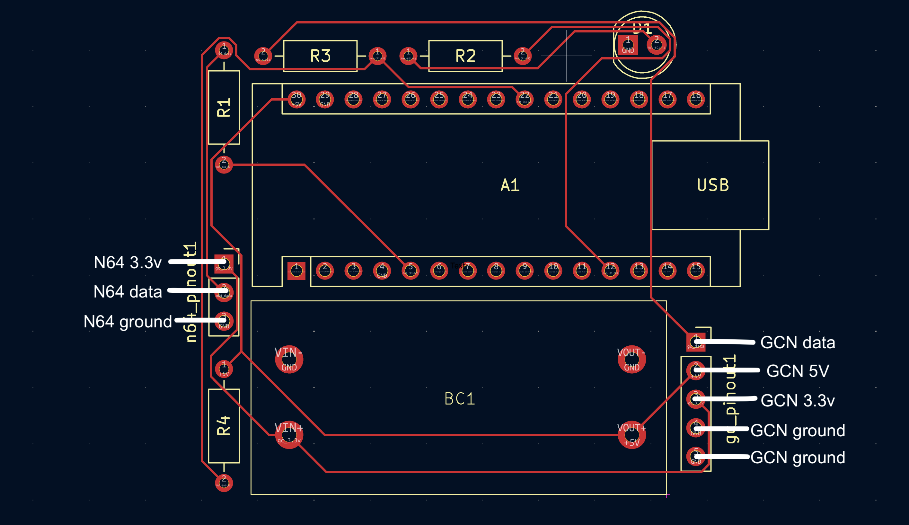
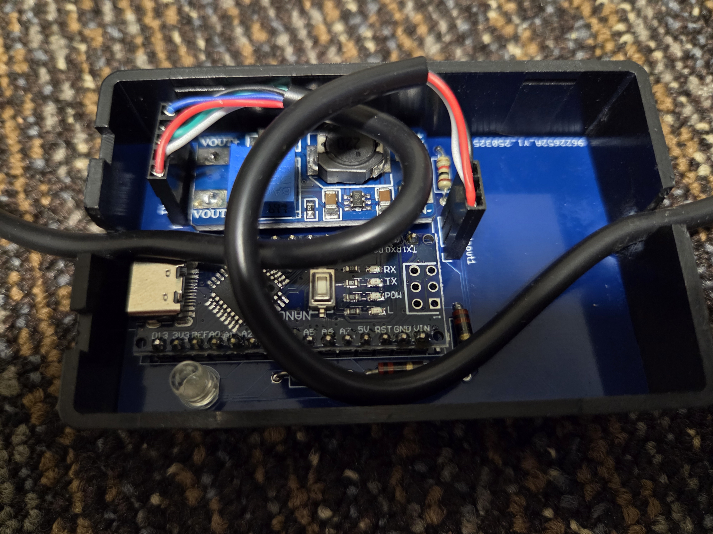
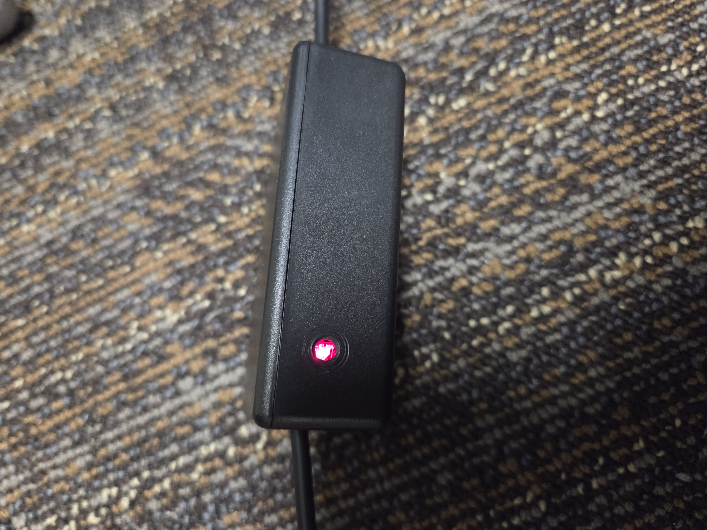

# gc-2-n64

PCB for a gamecube to N64 controller adapter using [Raphaël Assenat](https://github.com/raphnet)'s v2.1 gc_to_n64 software ([here](https://www.raphnet.net/electronique/gc_to_n64/index_en.php), see also [here](https://github.com/raphnet/gc_to_n64])).

The PCB design was heavily inspired by and drawn from [SuperSpongo's DIY adapter design](https://circuit-board.de/forum/index.php/Thread/28130-Raphnets-GameCube-Controller-to-N64-Adapter-v2/).

# Instructions

## Assembly

This project requires an Arduino Nano (though I believe any Arduino running at 5V/16MHz should work) and a DC-DC 2V-24V to 5V-28V step-up converter (the N64 provides 3.3V and we need 5V to power the Gamecube controller). You'll also need a 1KΩ resistor (R4 on the schematic), two 22Ω resistors (R1 and R3), a 220Ω resistor (R2), an LED (D1), a male N64 controller port / cable, and a female Gamecube port / cable.

(Note: If you want to modify the KiCad files, you'll need the schematic and footprint files for the boost converter found [here](kicad/gc_2_n64/boost-converter-files)).

The step-up converter needs to be calibrated to output exactly 5V when receiving 3.3V. You can do this by connecting it to a 3.3V source, such as the N64, then turning the screw on the side until the output is correct.

When soldering the wires from the Gamecube in and N64 out, follow the labels in this image:



For the N64 pinout, see [here](https://consolemods.org/wiki/N64:Connector_Pinouts). Generally, the red cable is power, white is data, and black is ground.

Gamecube pinouts are all over the place depending on which vendor you purchase from. The best resource I am aware of is [this one](https://docs.google.com/spreadsheets/d/1X-F21F838uQRCuYsc7nQoAv6I2dchvXtBSNTf-ZOc9M).

## Example of Finished Project

The assembled PCB:



The LED indicator:



Final product:


## Flashing

To flash the Arduino, you will need [avrdude](https://github.com/avrdudes/avrdude). I successfully flashed the v2.1 raphnet hexfile (found [here](https://www.raphnet.net/electronique/gc_to_n64/index_en.php#8)) using the following command:

```
/path/to/avrdude /path/to/avrdude.conf -v -V -patmega328p -carduino -P/path/to/serial/port -b115200 -U lfuse:w:0xd7:m -U hfuse:w:0xdc:m -U efuse:w:0x01:m -D -Uflash:w:/path/to/hexfile
```

The path to the serial port can be obtained from the [Arduino IDE](https://www.arduino.cc/en/software/).

The -U flags modify the low byte, high byte, and extended byte on the Arduino. I'm honestly not sure if this is necessary, but it's what the [instructions](https://www.raphnet.net/electronique/gc_to_n64/index_en.php#8) say to do.
