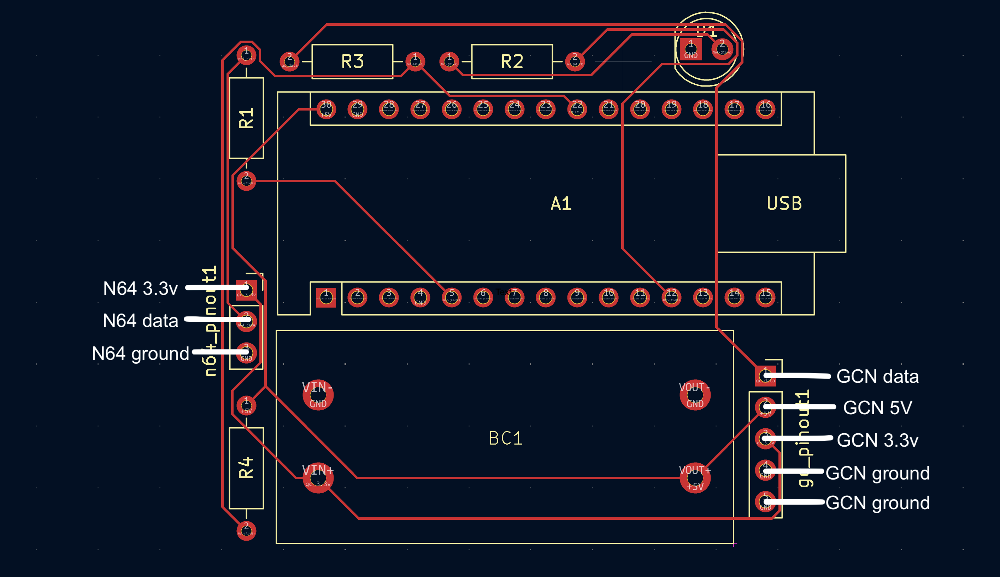
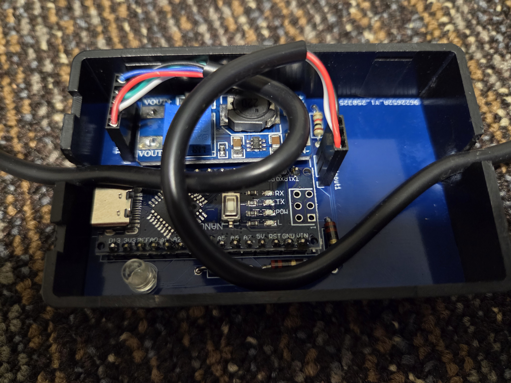
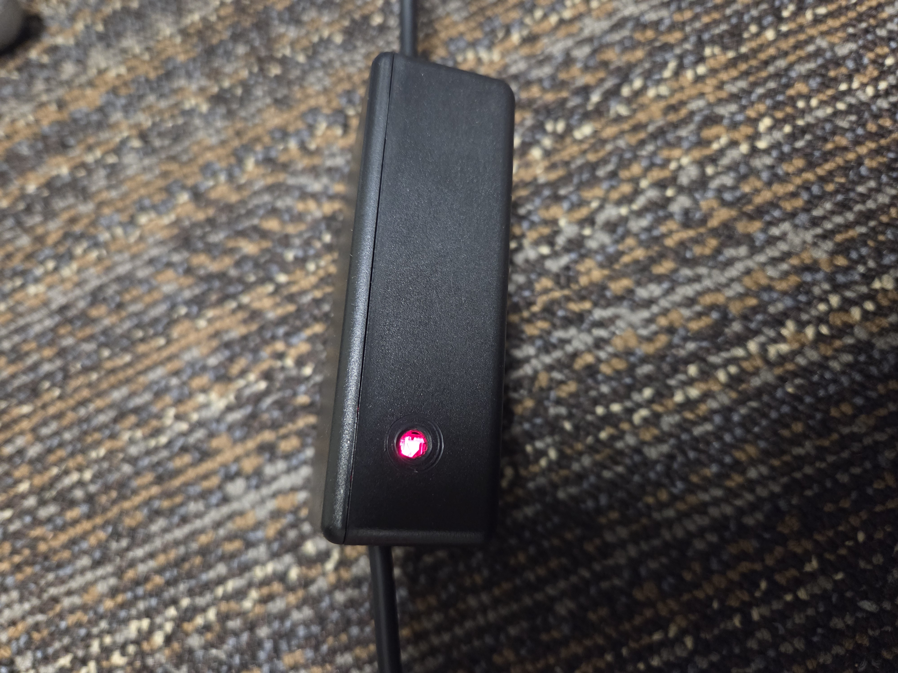

# gc-2-n64

PCB and custom firmware for a gamecube to N64 controller adapter. The firmware is an updated version of [Raphaël Assenat's](https://github.com/raphnet)'s v2.1 gc_to_n64 software ([here](https://www.raphnet.net/electronique/gc_to_n64/index_en.php), see also [here](https://github.com/raphnet/gc_to_n64)). It implements two major new features: an input viewer (from the USB port on the Arduino, compatible with RetroSpy) and a notch calibrator (heavily adapted from [Zenith Labs' algorithm](https://github.com/ZenithControlLabs/Zenith_FW)). It also allows many more degrees of flexibility when configuring soft triggers -- triggers can be mapped at 5% press, 10% press, 15% press, and so on until 100%. 

I have also included a file (index.html) that allows users to generate custom button mappings locally. Download the file and run it in a web browser to use it.

The PCB design was heavily inspired by and drawn from [SuperSpongo's DIY adapter design](https://circuit-board.de/forum/index.php/Thread/28130-Raphnets-GameCube-Controller-to-N64-Adapter-v2/). And as mentioned before, the credit for 99% of the ideas and code goes to Raphnet, Zenith Labs, and SuperSpongo. Because I modified firmware licensed under the GPLv3 License, the code in src/ is licensed under the GPLv3 License. The PCB is licensed under the MIT license.

# Instructions

## Assembly

This project requires an Arduino Nano (though I believe any Arduino running at 5V/16MHz should work) and a DC-DC 2V-24V to 5V-28V step-up converter (the N64 provides 3.3V and we need 5V to power the Gamecube controller). You'll also need a 1KΩ resistor (R4 on the schematic), two 22Ω resistors (R1 and R3), a 220Ω resistor (R2), an LED (D1), a male N64 controller port / cable, and a female Gamecube port / cable.

(Note: If you want to modify the KiCad files, you'll need the schematic and footprint files for the boost converter found [here](pcb/kicad/gc_2_n64/boost-converter-files)).

The step-up converter needs to be calibrated to output exactly 5V when receiving 3.3V. You can do this by connecting it to a 3.3V source, such as the N64, then turning the screw on the side until the output is correct.

When soldering the wires from the Gamecube in and N64 out, follow the labels in this image:



For the N64 pinout, see [here](https://consolemods.org/wiki/N64:Connector_Pinouts). Generally, the red cable is power, white is data, and black is ground.

Gamecube pinouts are all over the place depending on which vendor you purchase from. The best resource I am aware of is [this one](https://docs.google.com/spreadsheets/d/1X-F21F838uQRCuYsc7nQoAv6I2dchvXtBSNTf-ZOc9M).

## Example of Finished Project

The assembled PCB:



The LED indicator:



Final product:


## Flashing

To flash the Arduino, you will need [avrdude](https://github.com/avrdudes/avrdude) and the latest gc_2_n64.hex hexfile (see [Releases](https://github.com/pilgrimtabby/gc-2-n64/releases)). I successfully flashed the firmware using this command:

```
/path/to/avrdude /path/to/avrdude.conf -v -V -p atmega328p -c arduino -P /path/to/serial/port -b115200 -D -U flash:w:/path/to/hexfile
```

The path to the serial port can be obtained from the [Arduino IDE](https://www.arduino.cc/en/software/).

For detailed usage of the firmware, see Raphnet's [instructions](https://www.raphnet.net/electronique/gc_to_n64/index_en.php#8). To use the new input display, just connect the Arduino to your PC via the Arduino's USB port. To use the notch calibrator, hold down the start button for 8 seconds to access the menu, then press R, then press A. Leave the control stick at neutral and press A. The LED will blink. Do the same thing for the eight notches, starting with straight up and moving clockwise around the gate. The mapping will be saved between sessions. To clear it, press A in the R menu.

Questions, issues, PRs, etc. more than welcome!
